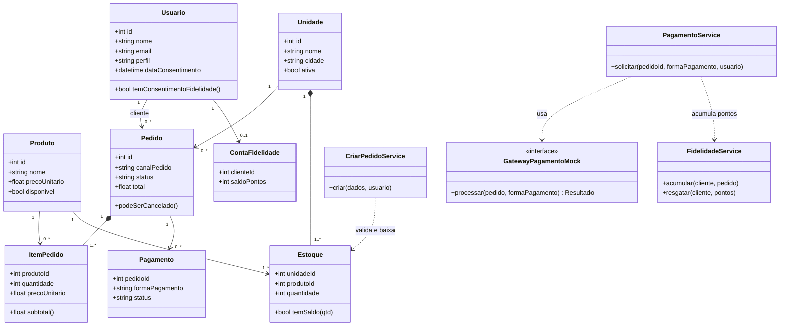
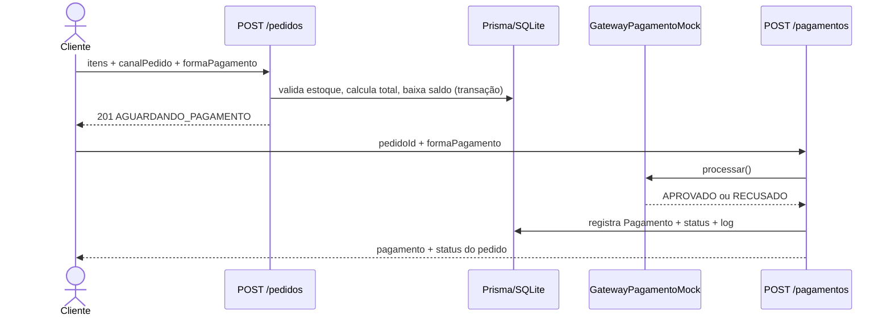

# Diagrama de classes (visão de domínio)

```mermaid
classDiagram
    class Usuario {
        +int id
        +string nome
        +string email
        +string perfil
        +datetime dataConsentimento
        +bool temConsentimentoFidelidade()
    }
    class Unidade {
        +int id
        +string nome
        +string cidade
        +bool ativa
    }
    class Produto {
        +int id
        +string nome
        +float precoUnitario
        +bool disponivel
    }
    class Estoque {
        +int unidadeId
        +int produtoId
        +int quantidade
        +bool temSaldo(qtd)
    }
    class Pedido {
        +int id
        +string canalPedido
        +string status
        +float total
        +podeSerCancelado()
    }
    class ItemPedido {
        +int produtoId
        +int quantidade
        +float precoUnitario
        +float subtotal()
    }
    class Pagamento {
        +int pedidoId
        +string formaPagamento
        +string status
    }
    class ContaFidelidade {
        +int clienteId
        +int saldoPontos
    }
    class GatewayPagamentoMock {
        <<interface>>
        +processar(pedido, formaPagamento) Resultado
    }
    class CriarPedidoService {
        +criar(dados, usuario)
    }
    class PagamentoService {
        +solicitar(pedidoId, formaPagamento, usuario)
    }
    class FidelidadeService {
        +acumular(cliente, pedido)
        +resgatar(cliente, pontos)
    }

    Usuario "1" --> "0..*" Pedido : cliente
    Unidade "1" --> "0..*" Pedido
    Pedido "1" *-- "1..*" ItemPedido
    Produto "1" --> "0..*" ItemPedido
    Unidade "1" *-- "1..*" Estoque
    Produto "1" --> "1..*" Estoque
    Pedido "1" --> "0..*" Pagamento
    Usuario "1" --> "0..1" ContaFidelidade
    PagamentoService ..> GatewayPagamentoMock : usa
    CriarPedidoService ..> Estoque : valida e baixa
    PagamentoService ..> FidelidadeService : acumula pontos
```

O fluxo crítico em sequência (recomendado pelo roteiro) está resumido abaixo; a versão completa de cada caso de uso está em `docs/casos-de-uso.md`.

```mermaid
sequenceDiagram
    actor Cliente
    participant API as POST /pedidos
    participant BD as Prisma/SQLite
    participant Mock as GatewayPagamentoMock
    participant APIPg as POST /pagamentos

    Cliente->>API: itens + canalPedido + formaPagamento
    API->>BD: valida estoque, calcula total, baixa saldo (transação)
    API-->>Cliente: 201 AGUARDANDO_PAGAMENTO
    Cliente->>APIPg: pedidoId + formaPagamento
    APIPg->>Mock: processar()
    Mock-->>APIPg: APROVADO ou RECUSADO
    APIPg->>BD: registra Pagamento + status + log
    APIPg-->>Cliente: pagamento + status do pedido
```
